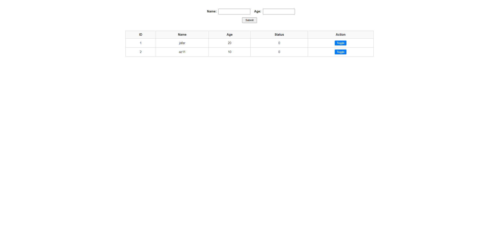

# Database Web Application (PHP & MySQL) 🗄️

This project is a practical implementation of a dynamic website connected to a database. The goal of this task was to create a web interface using **PHP** that interacts with a backend **MySQL** database, and to host it live on the internet via **InfinityFree**.

## 🧠 Development & Deployment Process

The database-driven website was built and deployed by following these steps:

1. Designed the database structure (Tables, Columns, and Data Types) to store the required information.
2. Utilized **phpMyAdmin** (via InfinityFree cPanel) to create the MySQL database and insert initial data records.
3. Developed backend scripts using **PHP** to establish a secure connection between the web interface and the server's database.
4. Wrote **SQL queries** within the PHP code to retrieve data dynamically and display it correctly on the frontend.
5. Uploaded the `.php` files to the `htdocs/database` directory on the InfinityFree server using the Online File Manager.

---

## 📁 Repository Structure
*(Note: These are the typical files associated with this project)*
* `index.php`: The main webpage that fetches, processes, and displays data from the database.
* `db_connect.php`: A configuration script containing the database credentials (hostname, username, password, DB name) to establish the connection.
* `database.sql`: An SQL dump file containing the database schema to recreate the tables locally.

## 🛠 Prerequisites
To run this code locally on your machine, you will need:
* A local server environment like **XAMPP**, **WAMP**, or **MAMP** (which includes Apache, MySQL, and PHP).
* To import the `.sql` file into your local phpMyAdmin.
* To update the database connection credentials in your PHP file to match your local setup (usually `root` for username and blank for password).

## 🚀 How to Access (Live Demo)
The database application is currently live. The data you see on the page is being fetched in real-time from the backend server. You do not need to download anything to view it.

Simply click the link below to visit the live site:
**🔗 [Visit the Live Database Website Here](https://jafar-smartmethods.kesug.com/database/index.php)**

## 📊 Results

The final output is a fully functional dynamic web page. Instead of static HTML, the website successfully connects to a live MySQL database, executes queries, and renders the retrieved information seamlessly to the user, demonstrating core full-stack web development capabilities.
